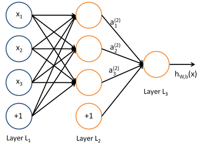
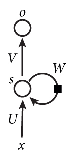
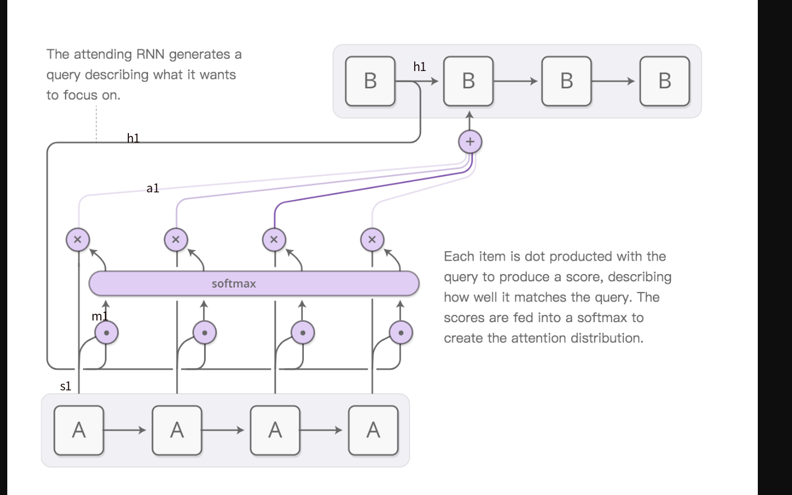

## 数据处理

Categorical 特征（机器学习不能理解），需要转化为树枝特征

国籍进行编码-->把国籍编码变成数字（但是这种数字并不是数字特征，因为编码之间有大小关系）-->编码的one-hot encoding（把0编号表示未知或者缺失）（标准正交基向量组成的二维矩阵）

文本处理：
- 1.Tokenization（把文本分割成单词）
- 2.计算词频。把单词映射到一个数字（具体做法是2中得到的词频排序，对排序结果重新从1开始编码，同时去掉低频词汇）
- 3.对上面的的编码进行one-hot encoding（有几个单词就要生成多少纬的矩阵）
- 4.文本有长有短，把文本变成相同的长度（砍掉一部分或者NULL padding）

但是实际使用时如果编码数据有10000个（1万个国家）one-hot encoding就会产生1万维度的向量-->Wording Embedding(把高维向量映射为低维向量)

Wording Embedding：
- P(d\*v)   \*   one-hot 向量ei(v\*1)  =Xi (d\*1)
- d用cross validation选择一个合适的d
- keras调用 `model.add(Embedding(vocabulary,embedding_dim,input_length=word_num))`  其中vocabulary表示v（国家数） embedding_dim表示d   input_length输入句子长度  (将会输出input_length\*d的矩阵，一个句子用20个单词，每个单词用8维词向量表示 )     （p向量的具体内容是什么，d怎么生成的？？？？）

机器学习Embedding层， Flatten层和Dense层
- Flatten层把20\*8的矩阵压扁变成160纬度的向量
- Dense层 全连接层 

## 深度学习
神经网络:

最左边的层叫做输入层，这层负责接收输入数据；最右边的层叫输出层，我们可以从这层获取神经网络输出数据。输入层和输出层之间的层叫做隐藏层。

隐藏层比较多（大于2）的神经网络叫做深度神经网络。而深度学习，就是使用深层架构的机器学习方法。

简单来说深层网络能够表达力更强，你和同一个函数，深层需要更少的神经元节省资源但是不容易训练，需要大量数据。

### 神经元(感知器)

x表示输入,w表示权值,w0表示偏置项。

激活函数:初始设置的一个将要被拟合的曲线(机器学习是一个拟合神经网络的过程,实际上是对于给定含参函数求函数合适的参)(激活函数越合适拟合过程就越短)(个人理解)

一个神经元只能解决一条直线的问题

对于y=a\*x+b    w项最终求得a,w1最终求得b。

使用微积分的梯度下降法找到最优解（待补充）

## 神经网络和反向传播算法
神经元和感知器本质上是一样的，只不过我们说感知器的时候，它的激活函数是阶跃函数；而当我们说神经元时，激活函数往往选择为sigmoid函数或tanh函数。

现在，我们需要知道一个神经网络的每个连接上的权值是如何得到的。我们可以说神经网络是一个模型，那么这些权值就是模型的参数，也就是模型要学习的东西。然而，一个神经网络的连接方式、网络的层数、每层的节点数这些参数，则不是学习出来的，而是人为事先设置的。对于这些人为设置的参数，我们称之为超参数(Hyper-Parameters)。

## CNN
Convolutional Neural Network (卷积神经网络)

激活函数 ：Relu函数  f(x)= max(0,x)。

- 速度快 计算代价小。

## RNN
语言模型就是这样的东西：给定一个一句话前面的部分，**预测**接下来最有可能的一个词是什么。
 
 
 U,V,W为权重矩阵 x,s,o表示输入层，隐藏层，输出层（每一层由多个神经元构成）(输入层的圆圈能不能叫神经元？？？)
 
 输入层读取数据，隐藏层里面是激活函数，输出层里面也是激活函数负责输出。
 
展开图为

 
 - W只有一个
 - 每个神经元的输入为输入层输入x[i]的数据和上一层隐藏的输出s[i-1]
 - s跟o的区别：一个隐藏层神经元有一个输出s，o为s和权重矩阵V进行计算的结果
 - 特点：当前神经元的处理会受之前处理的所有神经元的影响。
 - 跟输入内容的顺序有关？？？（论文中说这个东西包含输入指令的顺序信息）
 
问题：
-  RNN在训练中很容易发生梯度爆炸和梯度消失，这导致训练时梯度不能在较长序列中一直传递下去，从而使RNN无法捕捉到长距离的影响。
-  这个问题只能被减轻
- 最好的解决方法是别让它太长（例如对语言的处理就是不要长句子）

### 举例--基于RNN的语言模型

一个句子`我 昨天 上学 迟到 了`

1. 向量化：
	- 为里面的字或词编号。
	- 把编号设为N维向量（N为编号数）（N维正交基，任意的几个向量不能表示其他向量）
	- 语言模型的输出是下一个最可能的词，神经网络的输出是N维向量，向量中每个元素对应着下个词可能出现的概率。
    
2. Softmax层
    - 是进行了一个函数处理，把输入的向量变成了0-1之间的正数，所有项总和为1
    
3. 语言模型的训练
    - 标签的处理跟输入的处理类似（是某个词的概率是1，是其他词的概率全为0）
    
    

## attenthon模型

hard attention 和soft attention
可以看到，hard attention会专注于很小的区域，而soft attention的注意力相对发散

Attention Mechanism可以帮助模型对输入的X每个部分赋予不同的权重，抽取出更加关键及重要的信息，使模型做出更加准确的判断，同时不会对模型的计算和存储带来更大的开销，这也是Attention Mechanism应用如此广泛的原因。

Sensory Memory-->Working Memory(短期记忆) -->Long-term Memory

把注意力集中在一个点，翻译长句子时关注短句子

**encoder-decoder：**一个用来将接收待翻译语句，对其进行编码，最后输出一个vector，这个网络叫encoder。传给另一个RNN网络，该网络用来根据vector产生目标语言的翻译语句，这个网络叫做decoder。

encoder接收了不管多长的语句，最后输出的只是最后一个vector，当语句很长时，这个vector能否有效地表示该语句是很值得怀疑的。

A和B均为RNN模型。A为encoder，B为decoder
A接收了4个字每个字都产生了一个输出s，B把输出给了下一个神经元的同时把输入信息和输入

主要是下面这些步骤
1. h1 分别与s1，s2，s3，s4做点积，产生了四个数，称其为m1，m2，m3，m4（这些都是标量，不是向量了！）
2. m1，m2，m3，m4 传到一个softmax层，产生一个概率分布a1，a2，a3， a4。
3. 将a1，a2，a3， a4 与s1，s2，s3，s4分别相乘，再相加，得到得到一个vector，称其为Attention vector。
4. Attention vector 将作为输入传到B网络的第二个cell中，参与预测。

如图，这是RNN的结构

实际上是把途中的W换掉了，换成了一个包含s[t-1]和A出现的概率的信息的向量。

RNN相比Attenthon比较：
- RNN会把所有信息同等看待，放进去的数据越长对每个信息的单独记忆能力越弱。
- Attention会关注在某些词上重点识别，对于长句子比较好。
- RNN每条指令同等看待，只是包含前后的序列信息。Attention不仅包含序列信息还包含这个词的重要性信息。

使用Attention关键点在于权重矩阵W1,W2......的生成

 