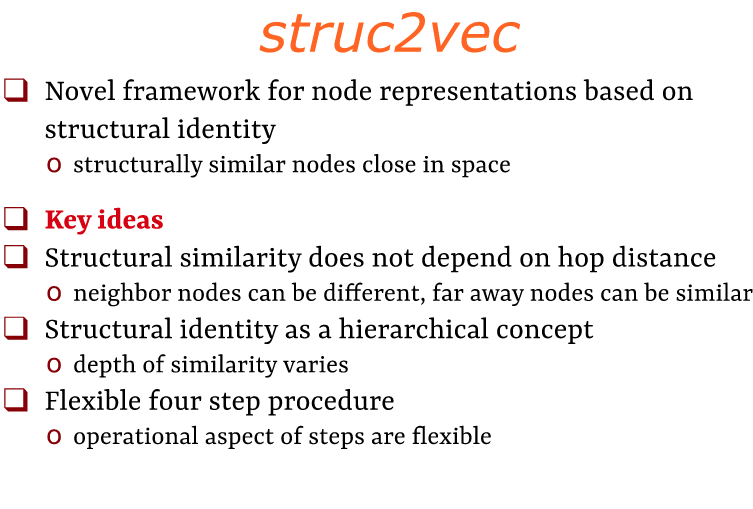
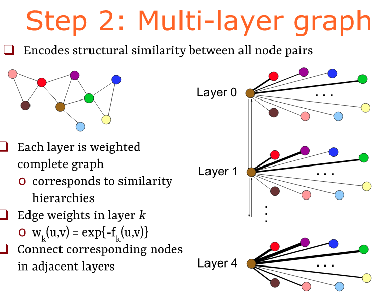
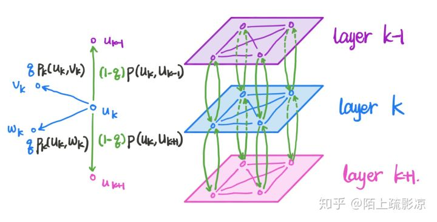
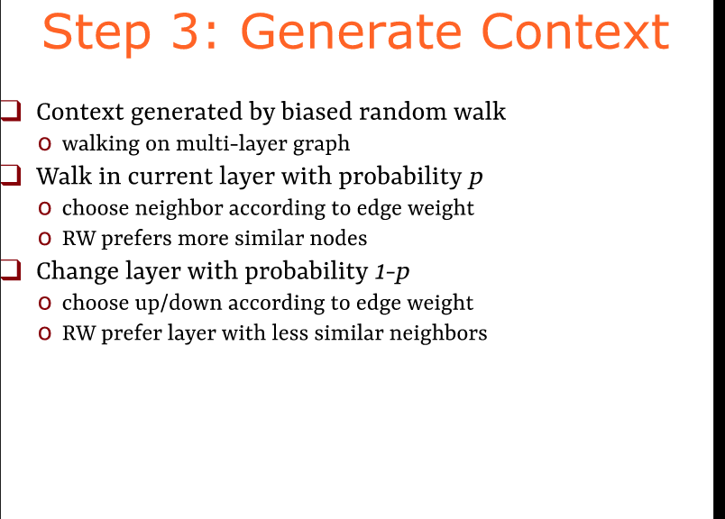
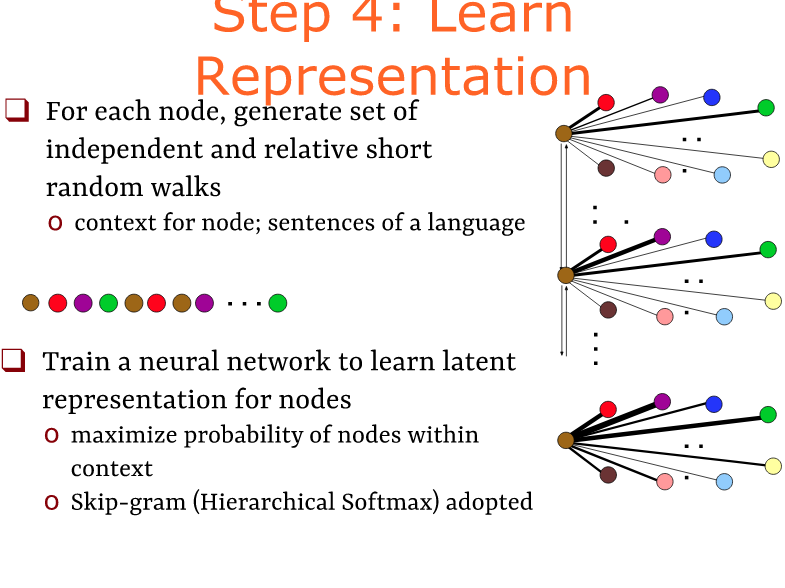
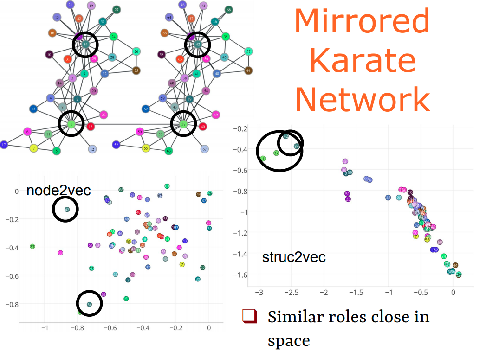
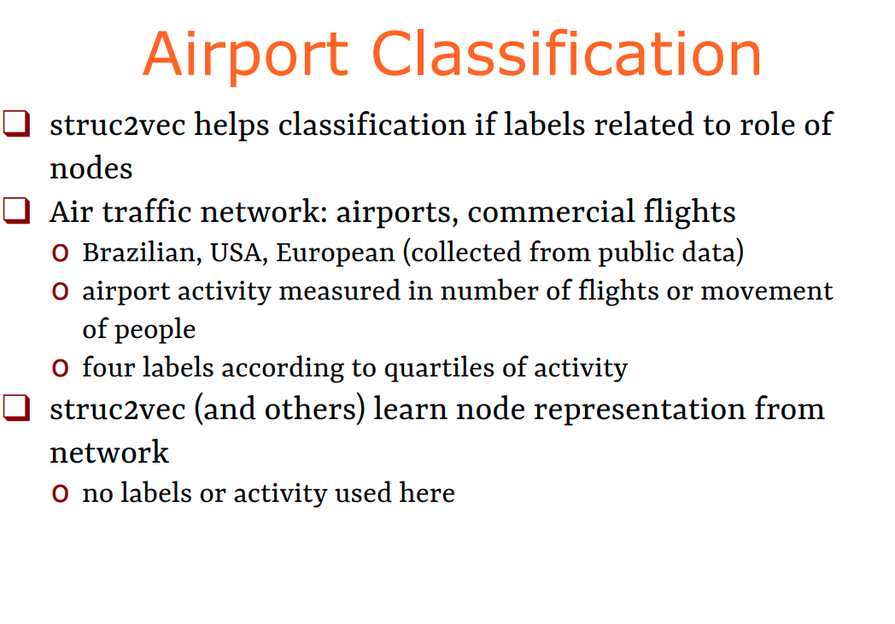
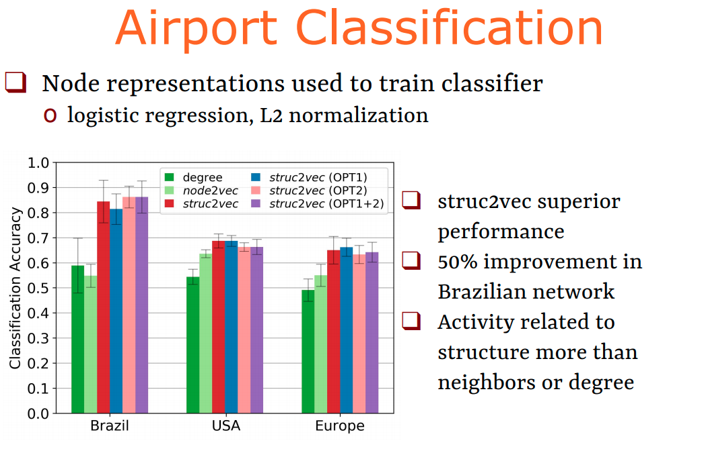
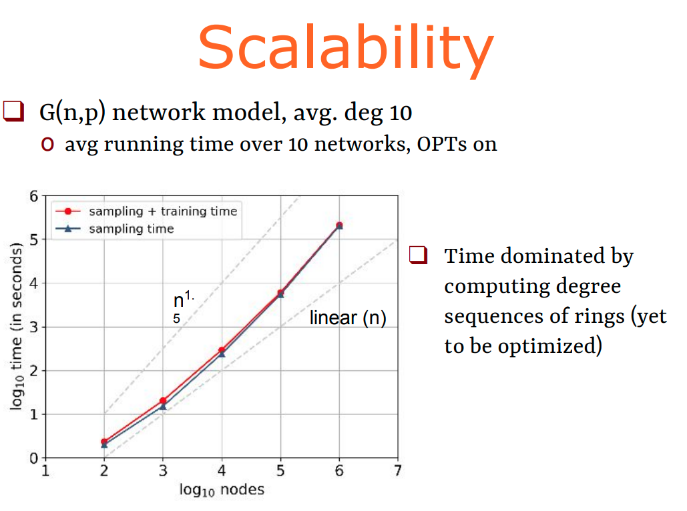
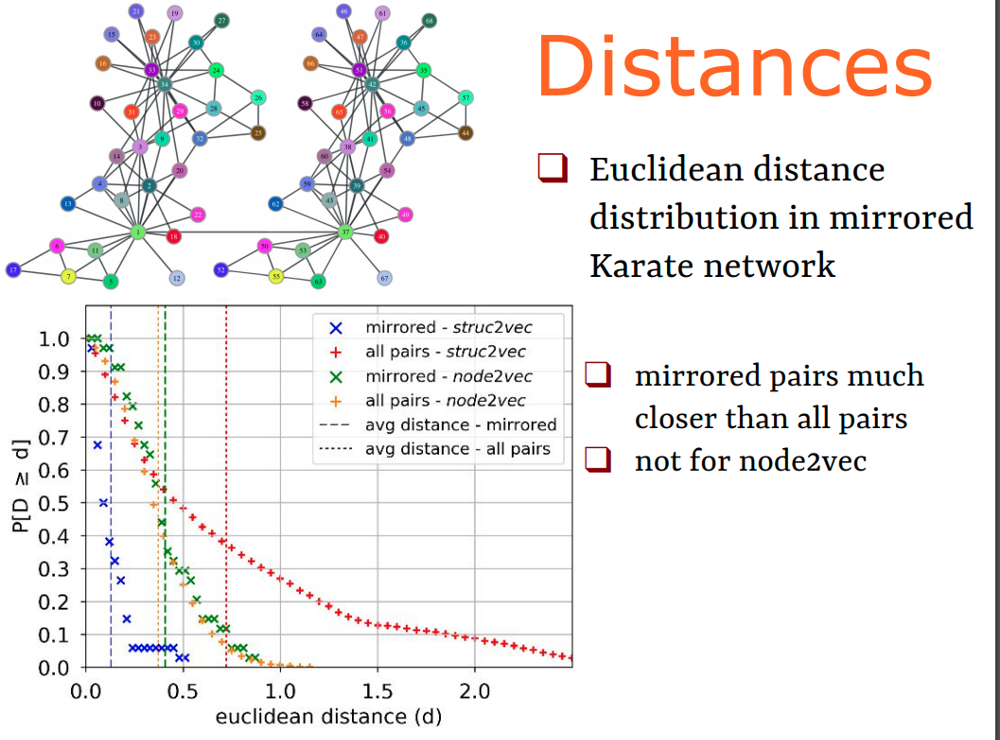

# struc2vec

## 说明
本文从官方提供的ppt出发，主要是进行一些介绍，并不涉及复杂公式的讲解，详细的公式讲解见底部的参考。

## Node Representations

将网络节点映射到另一个空间中，这个空间叫欧式空间(Euclidean space)

这里介绍了三种不同方式

- 第一个保留网络距离：所谓的距离是一个节点到另一个节点需要经过几个节点（分层）
- 第三个根据节点度的不同进行分类

## Structural Identity（结构性身份）

- 节点是什么。
- 节点识别方法
上图描述了强结构化等价(Automorphism)和结构相似 。想要实现的是在欧式空间里面(类似于图一的表)表示这种相似和等价关系

## 相关工作

- Word2vec：嵌入词(词来自句子中)到欧式空间
- deapwalk：嵌入网络节点通过随机游走产生句子（个人理解：所谓的句子是一个节点序列，这个序列由从开始节点到结束节点走过的一些序列组成，所谓随机是每次遇到分叉路口随机选择）
- node2vec：使用有偏见的随机行走生成句子。（控制随机游走的随机部分）关键点：deapwalk在原始网络上行走以生成上下文
- rolx：使用节点的特征矩阵计算低秩矩阵

## struc2vec

- 基于结构识别的 为节点表示的新颖的框架（为了嵌入节点所做的一个框架）
	- 主要做的是表示空间中结构相似的节点
- 结构相似性不依赖于跳距离
	- 相邻节点可能不同，距离远的节点可能相似。
-  结构认证作为等级概念
	- 相似深度不同（使用局部上下文层次结构说明合适两个节点结构相似） 
- 能够嵌入有四部过程，但是具体操作方面比较灵活（可以根据需要调整）。

## 步骤1

- 为两个结构相似节点分层度量（计算两个节点之间的距离）
- Rk(u)被表示为u节点距离为k的节点集合
- s（S）有序度序列

$f_k(u,v)$是距离，uv相距为k的节点之间的距离（这里的k是距离小于等于k的节点的集合）

$g(D_1,D_2)\geqslant 0$是衡量$D_1 和 D_2$的距离的函数并且

对于距离的描述g函数,文章采用了**Dynamic Time Warping(DTW)**来衡量两个有序度序列。

基于DTW，定义元素之间的距离函数 $d(a,b)=\frac{max(a,b)}{min(a,b)}-1$

**补充,什么是DTW**:对于两个序列A、B，对任意的$a\in A,b \in B$定义一个距离函数[d(a,b)]表示a与b的距离，DTW想利用这样定义的距离函数找到序列A、B的最小距离。其中g的最终表示为

**注意**:这个距离是由节点的度的信息得出来的,被标识节点你的度还有距离为1的节点的度,节点距离为2的度等。最终的f是距离的累加。

## 步骤2--多层图

从上一步中得到的距离来构建一个层次化的带权图（用于后续的随机游走）

- 计算所有节点对之间的距离。
- 每一层是一个带权完全图（任意两个定点之间都有变连接）
  - 对应于相似层次
- 在k层的权值为:$w_k(u,v)= e^{-f_k(u,v)}$ 
  - 在这种定义里边的权值小于1，只有距离为0时权值为1（也就是权值越接近1就越相似）
- 将相应节点连接到相邻层

每一层都是一个带权完全图只是具体权值的计算方式不同（但是每一层的权值计算都和距离有关）。

### 层与层之间的连接
对每个顶点，都会和其对应的上层顶点还有下层顶点相连。边权定义为

$w(u_k,u_{k+1})=\log{(\Gamma_{k}(u)+e)},k=0,...,k^*-1$

$w(u_k,u_{k-1})=1$

其中 $\Gamma_k(u)$ 是第k层与u相连的边的边权大于平均边权的边的数量。

$\Gamma_k(u)$ 实际上表示了第k层中，有多少节点是与节点u相似的，如果u与很多节点都相似，说明此时一定处于低层次，考虑的信息太少，那么$\Gamma_k(u)$将会很大，即$w(u_k,u_{k+1})>w(u_k,u_{k-1})$，对于这种情况，就不太适合将本层中的节点作为上下文了，应该考虑跳到更高层去找合适的上下文，所以高层的权重更大。

## 步骤3--生成上下文

- 通过有偏见的随机游走生成上下文（在多层图里面游走）
- 用概率p在当前层游走。
    - 通过变的权重选择邻居
    - RW更喜欢相似的节点
- 用概率1-p改变层
  - 通过边的权重选择上或者下
  - RW更喜欢更喜欢更相似的相邻层。

使用有偏见的随机游走在构造出的图 M 中进行顶点序列采样。 每次采样时，首先决定是在当前层游走，还是切换到上下层的层游走。留在本层的概率为p。

## 步骤4-- 学习表示

- 对于每个节点，生成一个独立且相对短的随机游走。
  - 节点的上下文;语言的句子
- 训练一个神经网络去学习节点的潜在表示
  -  上下文中节点的最大概率
  -  采用了Skip-gram(Hierarchical Softmax)

有了上一步采样出来的随机游走（得到的是对于每个节点生成一个独立切相对短的随机游走序列）

然后直接套用word2vec中SGNS（skip-gram with negative sampling）就可以了。

Skip-Gram是给定input word来预测上下文 
（待补充）

Softmax 用在输出层，是进行了一个函数处理，把输入的向量变成了0-1之间的正数(概率)，所有项总和为1

## 优化

- 减少生成/存储多层图和节点的上下文的时间
-优化1： 减小度序列的长度
  - 使用对（度，出现次数）
- 优化2：减少多层图的边数。
  - 每个检点仅记录n个邻居
- 优化3：减少多层图的层数
  - 固定（小）层数
- 准线性缩放 （不懂）
  - 超过一百万个节点

## 实验

### Barbell Network

作者先在一个小的数据集上进行实验，构造了一个Barbel graph，这个图由两个完全图和连接两个完全图的桥构成。这个图是对称的，理论上两个完全图中的所有节点，除了与桥相连的两个节点，都是结构相似的。另外由于桥也是对称的，所有桥两边的对称的节点也是结构相似的。真正的各种应用的识别效果如下。

同构节点在空间中非常接近，类似于OPTs

- DeepWalk和node2vec显然是根据节点在网络中的距离映射到嵌入空间的，有着与原图十分相似的慢慢过渡的结构。因为skip-gram的机制导致两个完全图中的节点不可能同时出现在一个随机游走序列的某个窗口中，因而两个完全图中的节点被映射到了完全不同的位置。
- struc2vec的结果则完全如理论分析的那样
- RolX是一个可以分辨角色的框架，然而它的效果仍然没有struc2vec效果好。

### Karate Network

为了更好地说明结构相似性，将原网络复制了一份，使得每个节点都有一个与之结构相同的镜像节点。前面说过strcu2vec是可以处理不连通的网络的，但是其他的baseline不可以，因此为了公平，在两个网络之间添加了一条连接镜像节点的边。

- 镜像节点（颜色相同）的嵌入距离大都比较相近。
- 节点1、37、42、34这两组镜像节点与其他节点的嵌入距离较远，观察原网络可以发现，这两组节点实际上是两个社区的中心节点，度数均非常大。

## 机场分类

- 如果标签与节点的角色相关struc2vec有助于分类
- 空中交通网络：机场，商业航班
  - 巴西，美国，欧洲（从公共数据收集）
  - 航班数量或人员流动来衡量机场活动
  - 根据四位分数的四个标签
-  struc2vec（和其他）从网络学习节点表示
   -  此处为使用任何标签或活动

- 节点表示被用来训练分类器。
  - 逻辑回归，L2归一化
  - struc2vec性能优越
  - 在巴西的网络里面提升50%
  
## 总结

- Structural identity(结构鉴定):与节点角色相关的基于网络的对称概念。
- struc2vec: 学习表示结构特征的灵活框架
  - 多层图编码结构相似性
- struc2vec有助于基于角色进行分类
- 但是其他种类的图嵌入也是有用的（不一定可以代替他人）

## 补充
项目 https://github.com/leoribeiro/struc2vec

sampling：采样

$G(n,p)$网络模型，平均的度 10（超过10个网络的平均运行时间），开启OPTs

时间由计算环的读书序列决定（有待优化）

蓝色标记表示strcu2vec中镜像节点之间的距离分布，红色节点表示struc2vec中所有节点之间的距离分布橙色节点表示node2vec中镜像节点之间的距离分布，红色节点表示node2vec中所有节点之间的距离分布。虚线分别表示距离的平均值。

蓝绿对比struc2vec比

## 参考文献
https://blog.csdn.net/zjwreal/article/details/90758589  

https://zhuanlan.zhihu.com/p/63175042

https://www.youtube.com/watch?v=5usgZOTy0YY

https://www.cos.ufrj.br/~leoribeiro/struc2vec.html

ppt https://www.cos.ufrj.br/~leoribeiro/struc2vec-slides.pdf

论文 https://arxiv.org/pdf/1704.03165.pdf

