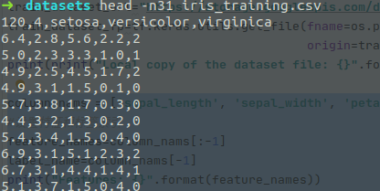

# tensorflow 训练测试过程

## 说明
参考 [https://www.tensorflow.org/tutorials/customization/custom_training_walkthrough?hl=zh-cn](https://www.tensorflow.org/tutorials/customization/custom_training_walkthrough?hl=zh-cn)

实际上是tensorflow官网提供的一个不错的例子，但是这个例子讲的并不详细。这里分析一下。

实际上在看这些代码之前我也只是知道一点入门的概念，比如什么是损失函数，激活函数之类的东西，所以这篇文章应该面向的是刚懂一点或者不懂概念的人。

# 执行一个训练过程

首先下载数据集，这个数据集很小，很快就会下载完的（能断点续下的）
```python
import os
import matplotlib.pyplot as plt
import tensorflow as tf

print("TensorFlow version: {}".format(tf.__version__))
print("Eager execution: {}".format(tf.executing_eagerly()))


train_dataset_url="https://storage.googleapis.com/download.tensorflow.org/data/iris_training.csv"
train_dataset_fp=tf.keras.utils.get_file(fname=os.path.basename(train_dataset_url),
                                         origin=train_dataset_url)
print(print("Local copy of the dataset file: {}".format(train_dataset_fp)))
```
接下来需要取出数据，把数据放到对应的位置。

数据的格式如图

是120行，5列的矩阵，前面几列对应各种属性，最后一列对应三种花名字详情参考上面链接。

第一步是设置好各个特征的标签。

```python
column_nams = ['sepal_length', 'sepal_width', 'petal_length', 'petal_width', 'species']
#设置特征和标签索引
feature_names=column_nams[:-1]
label_name=column_nams[-1]
print("Features: {}".format(feature_names))
print("Label: {}".format(label_name))

class_names = ['Iris setosa', 'Iris versicolor', 'Iris virginica']

```

然后取出来数据。

batch_size为一次取出来数据的行数，也是每次训练加入数据的长度
num_epochs设为1，在后面循环训练的时候是要再加一层循环的，这个值表示一共遍历多少次数据集，这里遍历一次

```python

batch_size=50 #一次取出来数据的行数
#由于此函数为训练模型生成数据，默认行为是对数据进行随机处理
train_dataset=tf.data.experimental.make_csv_dataset(
#shuffle表示取得列数据是不是随机取出的
    train_dataset_fp,
    batch_size,
    column_names=column_nams,#column列名
    label_name=label_name,#标签
    num_epochs=1, #重复数据集次数
    shuffle=False
)#把数据放到train_dataset
#只是把数据的列名字放入了column_names，label_name这两个列表
#在这里只是传入column_names和label_name 实际上应该是column_name中的出列label_name的部分都是feature_name
```

用下面的指令可以取出具体的数据，上一步虽然取出的是一个数据但是数据看不到（我感觉应该是一个地址的引用而已，用下面的函数可以获取到具体的值）
```python
features,labels=next(iter(train_dataset))#取出数据,返回值为张量（主要内容为一个矩阵，矩阵的行为feature_name和label_name列表的内容）
#列表下是一个矩阵，矩阵的行数由batch_size决定
print(feature_names)

#输出关系图
plt.scatter(features['petal_length'],
            features['sepal_length'],
            c=labels,
            cmap='viridis'
            )
plt.xlabel("Petal length")
plt.ylabel("Sepal length")
plt.show()
```

重新打包了一下数据，应该是原本的数据并不是需要的格式，需要的格式是特征，标签组成的两个大列表，实际上应该是可以不加这一步后面使用的时候进行一些简单处理的（这里咱也不知道要怎么处理）
在后面使用的时候是for x, y in train_dataset
```python

""" 
stack参数的解释
  x = tf.constant([1, 4])
  y = tf.constant([2, 5])
  z = tf.constant([3, 6])
  tf.stack([x, y, z])  # [[1, 4], [2, 5], [3, 6]] (Pack along first dim.)
  tf.stack([x, y, z], axis=1)  # [[1, 2, 3], [4, 5, 6]]
  """
# tf.stack 方法从张量列表中获取值，并创建指定维度的组合张量:


##要简化模型构建步骤，请创建一个函数以将特征字典重新打包为形状为 (batch_size, num_features) 的单个数组。
#此函数使用 tf.stack 方法，该方法从张量列表中获取值，并创建指定维度的组合张量:
def pack_features_vector(features, labels):
    features = tf.stack(list(features.values()), axis=1)
    return features, labels

#然后使用 tf.data.Dataset.map 方法将每个 (features,label) 对中的 features 打包到训练数据集中：
train_dataset = train_dataset.map(pack_features_vector)

```

数据拿到了，存到了对应位置接下来需要创建模型，这里创建了三层神经网络，输入层，输出层和隐藏层（不过实际使用中隐藏层会有更多层数）

因为这里判断最终结果有三种可能，输出结果是每种可能的概率，所以输出层有三个用来预测的节点
```python

#第一个层的 input_shape 参数对应该数据集中的特征数量，它是一项必需参数
#Dense实现如下操作 output = activation(dot(input, kernel) + bias)#activation为激活函数，kernel由图层创建的权重矩阵
model=tf.keras.Sequential([
    #使用默认值时，这将返回标准ReLU激活函数： max(x, 0)，对每个元素，如果大于零返回本身，小于0返回0
    tf.keras.layers.Dense(10,activation=tf.nn.relu,input_shape=(4,)),#节点，输入形式为4列
    tf.keras.layers.Dense(10,activation=tf.nn.relu),
    tf.keras.layers.Dense(3)#输出层包含三个用来预测的节点
])
```

使用模型

predictions输出的是一个向量计算的结果，这个结果可读性太差，使用softmax函数将会得到一个概率输出，可读性比较高
tf.argmax是得到预测结果（0,1,2中的一个。每行会得到这样的一个值）

上面的模型还没有经过训练，这里的预测结果很不理想
```python
predictions = model(features)
predictions[:5]
#每个样本针对每个类别返回一个 logit。这里设置的batch为30，输出层是有三个预测节点，predictions是一个30*3的矩阵

#要将这些对数转换为每个类别的概率，请使用 softmax 函数
# #对每个类别执行 tf.argmax 运算可得出预测的类别索引。不过，该模型尚未接受训练，因此这些预测并不理想。
tf.nn.softmax(predictions[:5]) #返回30*3的矩阵，每行和为1
#axis=1为tf.int32默认为tf.int64
print("Prediction: {}".format(tf.argmax(predictions, axis=1)))#每行会输出一个prediction（是预测结果）
print("    Labels: {}".format(labels))

```
定义损失函数

损失函数是来描述预测结果跟真实数据差距的，损失越小就越接近真实值
```python
#定义损失和梯度函数
#此函数会接受模型的类别概率预测结果和预期标签，然后返回样本的平均损失。(返回的是个函数)
loss_object=tf.keras.losses.SparseCategoricalCrossentropy(from_logits=True)
def loss(model,x,y):#是损失值的计算
    y_ = model(x)
    return loss_object(y_true=y,y_pred=y_)#返回的函数在这里传入真实值和预测值求平均损失
l=loss(model,features,labels)
print("Loss test:{}".format(l))
```

然后创建优化器（进行优化前的初始化准备）（所谓的优化是，原本模型计算从样本到结果的方法是使用默认的参数，现在的优化是调整这些参数，让计算的预测值更接近真实值也就是让损失变小）
```python

#使用 tf.GradientTape 的前后关系来计算梯度以优化你的模型:
def grad(model,inputs,targets):#计算梯度
    with tf.GradientTape() as tape:
        loss_value=loss(model,inputs,targets)
        #gradient 在这次tap中使用上下文记录计算梯度
        return loss_value,tape.gradient(loss_value,model.trainable_variables)


#创建优化器
#优化器会将计算出的梯度用于模型的变量以使loss函数最小化,learning_rate为步长  optimizer优化器
optimizer=tf.keras.optimizers.Adam(learning_rate=0.01)
```

接下来是真正的进行优化
```python


#计算单个优化步骤
loss_value,grads=grad(model,features,labels)#生成两个，一个梯度，一个损失值。梯度用来进行下一轮计算，损失值用来输出
print("Step: {}, Initial Loss: {}".format(optimizer.iterations.numpy(),loss_value.numpy()))#iterations迭代

optimizer.apply_gradients(zip(grads,model.trainable_variables))#这里进行梯度下降迭代
print("Step: {},         Loss: {}".format(optimizer.iterations.numpy(),#这里输出下降迭代次数
                                         loss(model, features, labels).numpy()))#这里计算损失值
```


## 循环训练

流程：
- 遍历num_epochs次数据集，每次设置一个损失和准确性均值
- 循环对每个batch进行处理：计算梯度和损失值，优化模型，获取到一些准确率和损失值的结果保存到列表
- num_epoch非常大不影响最终准确率，准确率在到达一定值之后基本不变或者下降
- optimizer=tf.keras.optimizers.Adam(learning_rate=0.001) 改变learning_rate会让训练变得很慢
- batch变小会让收敛曲线波动更小

```python
#训练循环

#保留结果用于绘制
train_loss_results=[]
train_accuracy_result=[] #accuracy准确性


#最终得到的是模型，损失率，，准确率
num_epochs=500 #训练集便利的次数
for epoch in range(num_epochs):
    epoch_loss_avg=tf.keras.metrics.Mean() #metrics指标
    epoch_accuracy=tf.keras.metrics.SparseCategoricalAccuracy()#Categorical分类的  Sparse稀疏
    # Training loop - using batches of 32
    for x, y in train_dataset:
        #每次循环处理完一个batch
        # 优化模型
        loss_value, grads = grad(model, x, y)#计算梯度和损失
        optimizer.apply_gradients(zip(grads, model.trainable_variables))#优化模型

        # 追踪进度
        epoch_loss_avg(loss_value)  # 添加当前的 batch loss
        # 比较预测标签与真实标签
        epoch_accuracy(y, model(x))
    train_loss_results.append(epoch_loss_avg.result())
    train_accuracy_result.append(epoch_accuracy.result())
    if epoch % 50 ==0:
        print("Epoch {:03d}: Loss: {:.3f}, Accuracy: {:.3%}".format(epoch,
                                                                epoch_loss_avg.result(),
                                                                epoch_accuracy.result()))

```

为了方便表示可以用matlab画出损失和预测结果的图像
```python
fig, axes = plt.subplots(2, sharex=True, figsize=(12, 8))
fig.suptitle('Training Metrics')
axes[0].set_ylabel("Loss", fontsize=14)
axes[0].plot(train_loss_results)
axes[1].set_ylabel("Accuracy", fontsize=14)#列
axes[1].set_xlabel("Epoch", fontsize=14)#行
axes[1].plot(train_accuracy_result)#具体数据
plt.show()
```
进行测试

```python

建立测试数据集
test_url = "https://storage.googleapis.com/download.tensorflow.org/data/iris_test.csv"

test_fp = tf.keras.utils.get_file(fname=os.path.basename(test_url),
                                  origin=test_url)

test_dataset = tf.data.experimental.make_csv_dataset(
    test_fp,
    batch_size,
    column_names=column_nams,
    label_name='species',
    num_epochs=1,
    shuffle=False)

test_dataset = test_dataset.map(pack_features_vector)

```


```python
#根据测试数据集评估模型
test_accuracy = tf.keras.metrics.Accuracy()

for (x, y) in test_dataset:
    logits=model(x)
    prediction=tf.argmax(logits,axis=1,output_type=tf.int32)
    test_accuracy(prediction,y)

print("Test set accuracy: {:.3%}".format(test_accuracy.result()))

tf.stack([y,prediction],axis=1)#把两个数据放到一个矩阵里，方便比较

predict_dataset = tf.convert_to_tensor([
    [5.1, 3.3, 1.7, 0.5,],
    [5.9, 3.0, 4.2, 1.5,],
    [6.9, 3.1, 5.4, 2.1]
])
predictions = model(predict_dataset)
for i, logits in enumerate(predictions):
  class_idx = tf.argmax(logits).numpy()
  p = tf.nn.softmax(logits)[class_idx]
  name = class_names[class_idx]
  print("Example {} prediction: {} ({:4.1f}%)".format(i, name, 100*p))
```

文件将会提供循环训练这个过程的代码，以及从网站上复制下来的原本的代码
