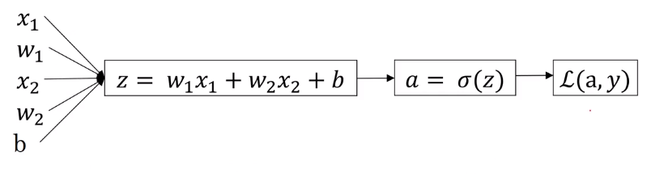

# 神经网络与深度学习

内容参考视屏 https://www.bilibili.com/video/BV164411m79z?p=3

## 神经网络是什么

每一个圆圈表示一个拟合函数(问题:这些圆圈需要自己预先设计一个定义吗? 如果定义,有什么标准??)


头尾足够多的x和y神经网络就能自己计算从x到y的精准映射函数.

## 用神经网络进行监督学习
   Structured Data:  具体的数字,可以表示成矩阵
   Unstructured Data:  音频,视频,文本等
   
   ## 深度学习兴起的原因
   人们有的数据多了,规模一直在推机器学习的进步
   
   数据,算力,算法.
   
   
   ## 二分分类和符号介绍
   
   forward pass (forward propagation step)正向传播
   backward pass(backward propagation step) 反向传播
   
   学习过程中一般会有一个正想传播和一个反向传播  
   
   
  例子:识别出图像是否是猫
  
  有红绿蓝三个矩阵(因为是彩色图片),每个矩阵都是64\*64(因为图片分辨率是64\*64)
  
把这些像素放图一个特征向量x(只是简单按照行合并到一起)
   
目标是做一个分类器他的输入是x输出是y(0或者1)

(x,y)表示一个单独的样本(A sigle training example)

x是一个nx维特征向量(nx-dimensional)

m表示样本总数,X表示训练集每个样本x是X矩阵里面的n维向量
  
有时候训练样本是行向量堆叠而不是像上图这种列向量堆叠,但是用上图的约定会简单好多

## logistic 回归

问题: 识别图片是否是猫
x表示nx维向量(图片),Logistic回归的参数是w(也是一个nx维向量),b是实数。从x,w,b预测y。

logistic函数(这里回答上面的问题:圆圈里面的函数是怎么定义的,是初始预测的一个函数这个函数叫激活函数)

  
  
  sigmal是一个介于0和1之间的数
  
  成本函数 被定义为平均值即1/m的损失函数只和,可以衡量算法的效果
   
   目标:找到使成本函数J(w,b)尽可能小的w和b
  
## 梯度下降方法
  w,b被初始化为0,逐渐往J函数值小的地方下降
  

## 计算图
这是正向的计算图
  

最后表示损失函数

反向计算图是从最右边函数进行求偏导数求出来原始数据的值(其实就是复合函数求导)

## m个样本梯度下降
  

损失函数j是累加求平均,dw,dz是每个样本求导的累加。上图只是进行了一次梯度下降。

一共进行两次循环:第一次遍历所有样本第二次遍历所有特征(特征应该是指w的数目),这里只有两个特征所以n=1,nx=2  (上图中只有两个dw,所以把第二层循环展开写了)

## 向量化--降低for循环的数量

```python
import numpy as np  #numpy使用的是并行化实现而跟GPU或CPU无关
import time

#向量化版本  1.4073848724365234
a=np.random.rand(1000000)
b=np.random.rand(1000000)
tic=time.time()
c=np.dot(a,b)
toc=time.time()
print(1000*(toc-tic))
print(c)

# 非向量化版本  449.38158988952637
c=0
tic=time.time()
for i in range(1000000):
    c+=a[i]*b[i]
toc=time.time()
print(c)
print(1000*(toc-tic))
```
结果显示,运行时间相差非常大若非必要一定要用numpy提供的向量化运行方。

对于m个样本使用梯度下降

  
这里使用梯度下降去掉了一个循环

  
  上图对zi的操作可以转变成矩阵的运算。
就能变成np操作

```python
Z=np.dot(w.T,x)+b  (b为实数,之后变成向量,这个叫python的广播机制)
```

## 向量化logistic回归的梯度输出

上文中进行了一些向量化的推倒,但是还是不能将第一层循环省去,这里的操作将省去第一层循环。
  

对dz的向量化如图
   
db，dw的向量化如图
   

最终向量化结果如图
   

## python中的广播
 
 例
 ```python
 import numpy as np

A=np.array([[56.0,0.0,4.4,68.0],
            [1.2,104.0,52.0,8.0],
            [1.8,135.0,99.0,0.9]])
# print(A)
cal=A.sum(axis=0)  #列相加  axis=1是水平
print(cal)
## 计算百分比

percentage=100*A/cal.reshape(1,4)#cal.reshape(行，列)把原列表分割成了二位数组，一行，四列
print(percentage)
# print(cal.reshape(2,2))
 ```
 广播的方式如图
   
 加减乘除的操作都可以，


  
   
   